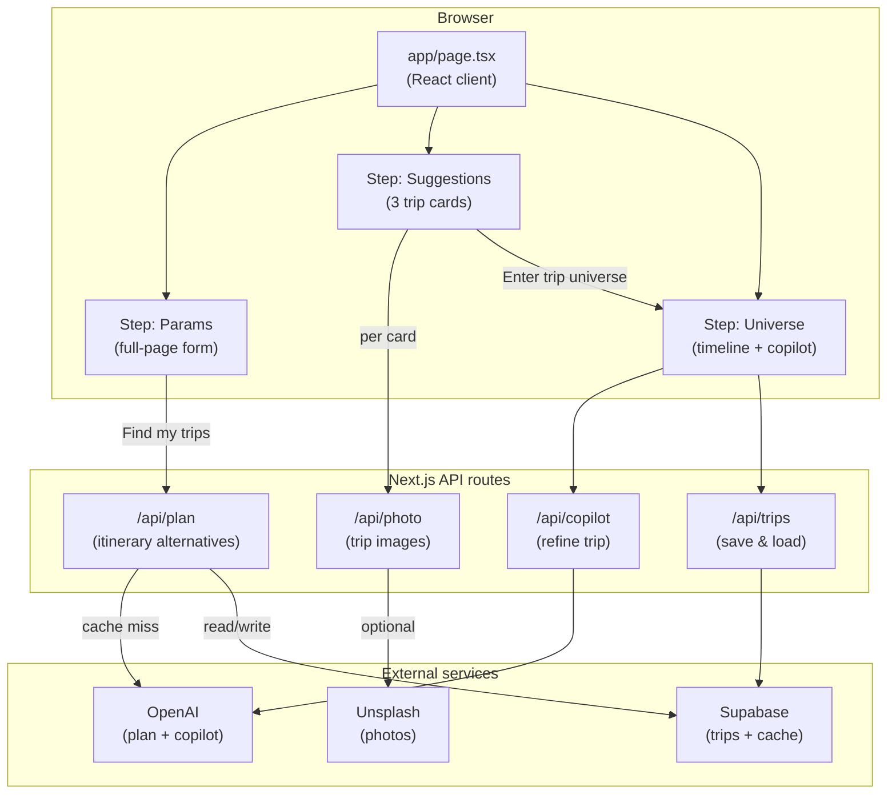
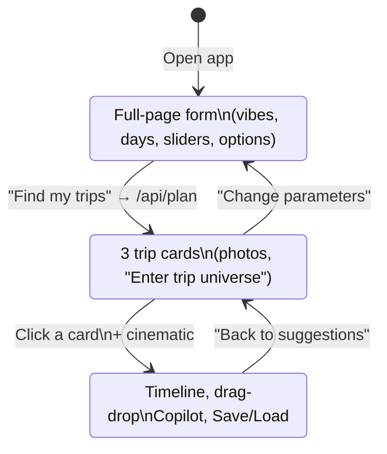

# Architecture & technical reference

Single reference for system design, stack, data flow, and conventions. For product vision and quality bar see [vision-and-quality.md](./vision-and-quality.md). For change history see [changelog.md](./changelog.md).

---

## 1. High-level architecture

---

## 2. User flow (steps)

---

## 3. Tech stack

| Layer   | Choice |
|--------|--------|
| Framework | Next.js 15 (App Router) |
| Language  | TypeScript |
| Styling   | Tailwind CSS (CSS variables for theme) |
| AI        | OpenAI (plan generation + copilot refinements) |
| DnD       | @dnd-kit (core + sortable + DragOverlay, a11y) |
| DB        | Supabase (trips, plan_cache) |
| Photos    | Unsplash (server-side via `/api/photo`; placeholder if unset) |

---

## 4. Key paths

| Role      | Path |
|-----------|------|
| UI        | `app/page.tsx` |
| Plan API  | `app/api/plan/route.ts` (OpenAI + plan_cache) |
| Photo API | `app/api/photo/route.ts` |
| Copilot   | `app/api/copilot/route.ts` |
| Trips     | `app/api/trips/route.ts`, `app/api/trips/[id]/route.ts`, `app/api/trips/[id]/share/route.ts` |
| Share     | `app/api/share/[token]/route.ts` (GET trip, PATCH if editor; uses service role) |
| Auth      | Supabase Auth via `lib/supabase/client.ts` (browser), `lib/supabase/server.ts` (API); `app/auth/callback/route.ts` |
| Types     | `lib/types.ts`, `lib/trip-preferences.ts` |
| DB schema | `docs/supabase-schema.sql`, `docs/supabase-schema-auth-and-share.sql` |
| Env       | `.env.example` (SUPABASE_SERVICE_ROLE_KEY for share links) |

---

## 5. Data flow

1. **Params:** User sets preferences (vibes, days, priciness, travel time, origin, transport, theme, weather, emphasis, constraints) and clicks **Find my trips**.
2. **Plan:** Client POSTs to `/api/plan` with prefs. API hashes prefs, checks Supabase `plan_cache`; on miss calls OpenAI (worldwide, actionable prompt), returns `{ alternatives: [PlanResponse, …] }` (3 items). Cache stores by hash.
3. **Suggestions:** Client shows three cards; each card can request an image from `/api/photo` (Unsplash or placeholder). User picks one → **Enter trip universe** → cinematic overlay → Universe.
4. **Universe:** Selected trip with hero image, metadata, horizontal timeline (Day 1 AM/PM/Eve, …). Drag-and-drop, inline edit, hover tooltips. **AI Copilot** and fine-tune buttons call `/api/copilot`; optional revised plan merged. **Back to suggestions** returns without re-fetch. Save/Load use `/api/trips` (Supabase); loaded trip opens in universe.

---

## 6. Data shape

- **PlanResponse:** `{ trip: { title, summary, vibe_tags, recommended_region, best_season, pace }, itinerary: Day[] }`.
- **Day:** `{ day, base_location, blocks: Block[] }`.
- **Block:** `{ id, time, title, type, notes }`.
- **API plan response:** `{ alternatives: PlanResponse[] }` (3 alternatives). Cache and trips store this shape where applicable. See `lib/types.ts` and `docs/supabase-schema.sql`.

---

## 7. Conventions

- Shared types in `lib/types.ts` and `lib/trip-preferences.ts`; APIs and page import from these.
- OpenAI called only from API routes; keys in env.
- User-facing copy in the app; no i18n yet.
- Design: clarity and restraint (Apple-inspired), refined travel editorial feel; see [vision-and-quality.md](./vision-and-quality.md).
