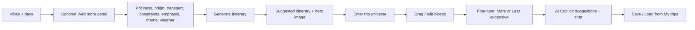
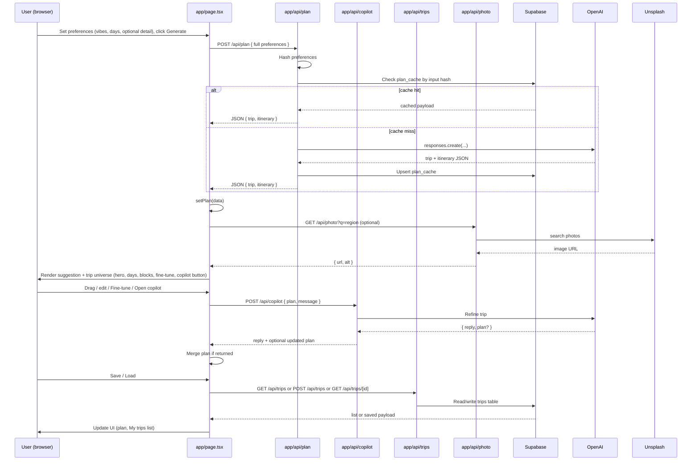
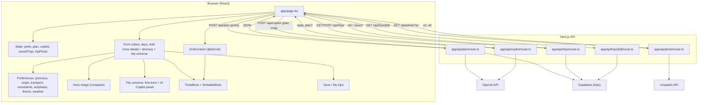
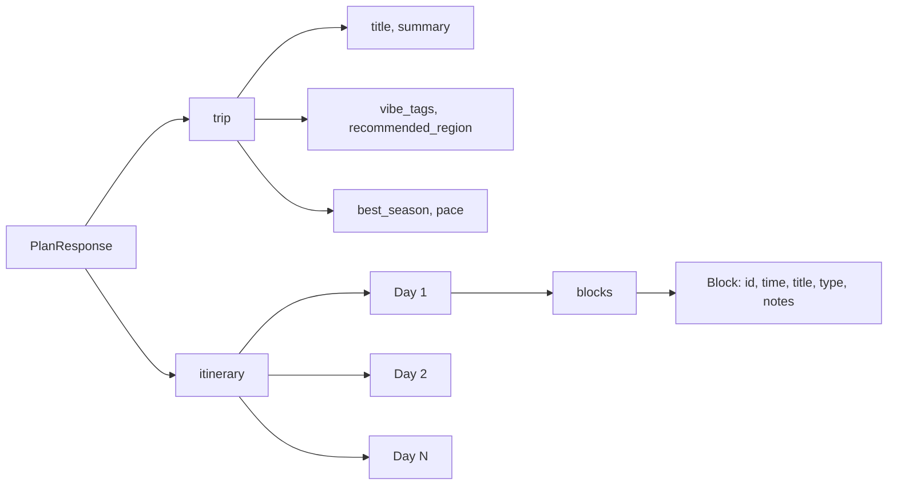

# How the Travel Planner works

This doc helps you explain the site to others: **what it does** and **how it’s built**, with flowcharts you can view in any Mermaid-supported viewer (e.g. GitHub, VS Code, or [mermaid.live](https://mermaid.live)).

---

## 1. User journey (what the user sees)

**In words:** The user sets vibes and days; they can toggle **Add more detail** to set priciness (slider), origin, max travel time, transport, constraints (e.g. wheelchair), emphasis (culture, history, fun, relax, etc.), theme (wedding, stag do, girls weekend, etc.), and weather. After **Generate itinerary**, they see the suggested trip and step into **Your trip universe** to drag and edit blocks. They can use **More expensive** / **Less expensive** or open the **AI Copilot** panel to click suggestions (e.g. “Add 2 museums”, “Less expensive options”) or type requests; the copilot can return a revised plan. Save/Load and plan cache work as before.

---

## 2. System flow (request → response)

**In words:** Generate hits `/api/plan`, which checks Supabase `plan_cache` by input hash; on miss it calls OpenAI and caches the result. The client optionally fetches a hero image from `/api/photo` (Unsplash). Save/load uses `/api/trips` (GET list, POST save, GET by id) backed by Supabase `trips` table. Drag and inline edits update client state; Save persists the current plan.

---

## 3. App structure (files and roles)

**In words:** `app/page.tsx` holds preferences (vibes, days, and optional detail: priciness, origin, transport, constraints, emphasis, theme, weather), plan state, and copilot state. The form has an “Add more detail” toggle for full dimensions. Plan generation uses `/api/plan` with full preferences (and optional Supabase plan cache). The **trip universe** includes fine-tune buttons and an **AI Copilot** side panel (suggestions + chat) that calls `/api/copilot`; optional revised plans are merged. Drag-and-drop uses **DragOverlay** and **defaultScreenReaderInstructions**. Save/Load use `/api/trips`. See `docs/supabase-schema.sql` for DB tables.

---

## 4. Data shape (what’s in a “plan”)

**In words:** A plan has **trip** (metadata) and **itinerary** (days with blocks). Saved trips in Supabase store the full plan as `payload` (same shape). Plan cache stores plans keyed by hash(vibes, days) to reduce OpenAI calls. Drag-and-drop and inline edits update client state; **Save this trip** persists to Supabase.

---

## Using these diagrams

- **GitHub / GitLab:** Paste the Mermaid blocks into a `.md` file; they render automatically.
- **VS Code:** Use a “Mermaid” or “Markdown Preview Mermaid” extension.
- **Online:** Copy a block into [mermaid.live](https://mermaid.live) to edit and export as PNG/SVG.
- **Presentations:** Use the “User journey” and “System flow” to explain the value and the tech in one slide each.
