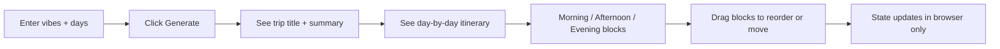
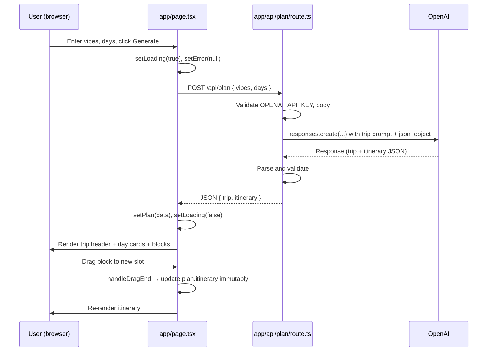
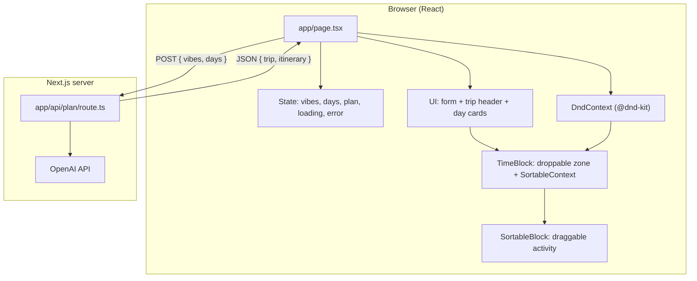
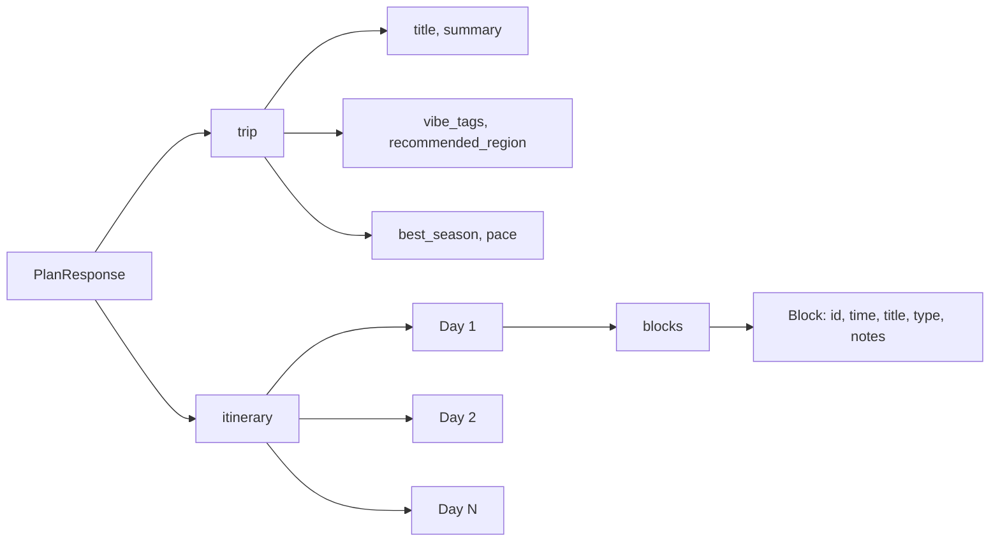

# How the Travel Planner works

This doc helps you explain the site to others: **what it does** and **how it’s built**, with flowcharts you can view in any Mermaid-supported viewer (e.g. GitHub, VS Code, or [mermaid.live](https://mermaid.live)).

---

## 1. User journey (what the user sees)

**In words:** The user types what they’re in the mood for (e.g. “space, solitude, nature, sun”) and how many days. After they click **Generate itinerary**, they get a trip idea (title, summary, region, season, pace) and a day-by-day plan. Each day is split into Morning, Afternoon, and Evening, with activity blocks. Soon they’ll be able to drag those blocks to reorder within a slot or move them to another day or time slot; the itinerary state updates in the browser (no persistence yet).

---

## 2. System flow (request → response)

**In words:** The React page sends a single POST with the user’s vibes and day count. The API route calls OpenAI with a fixed schema (trip metadata + itinerary with blocks). The API returns that JSON; the client stores it in state and renders the trip and days. When the user drags a block to another day or time slot, the client updates `plan.itinerary` immutably and re-renders. No database yet — everything lives in memory on the client.

---

## 3. App structure (files and roles)

**In words:** The only page is `app/page.tsx`. It holds all state and wraps the itinerary in `DndContext` (@dnd-kit). Each time slot (Morning, Afternoon, Evening) is a droppable zone with id `day-${day}-${time}`; each activity is a sortable item. On drag end, the client updates `plan.itinerary` immutably. The only API route is `app/api/plan/route.ts`; it talks to OpenAI and returns the plan.

---

## 4. Data shape (what’s in a “plan”)

**In words:** A plan has two top-level parts: **trip** (metadata and vibe) and **itinerary** (list of days). Each day has a day number, base location, and **blocks**. Each block has an id (e.g. `d1-m-1`), a time slot (morning/afternoon/evening), title, type (food, nature, culture, etc.), and notes. Drag-and-drop reorders and moves blocks between days and time slots; the same structure is updated in client state (and will be persisted when save/load is added).

---

## Using these diagrams

- **GitHub / GitLab:** Paste the Mermaid blocks into a `.md` file; they render automatically.
- **VS Code:** Use a “Mermaid” or “Markdown Preview Mermaid” extension.
- **Online:** Copy a block into [mermaid.live](https://mermaid.live) to edit and export as PNG/SVG.
- **Presentations:** Use the “User journey” and “System flow” to explain the value and the tech in one slide each.
