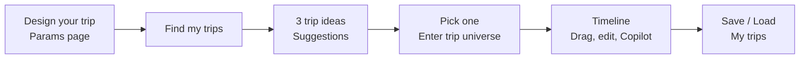

# How it works (user perspective)

Short explainer of the user journey. For system design, data flow, and diagrams see [architecture.md](./architecture.md).

---

## User journey

1. **Params:** User sets vibes, duration, budget, origin, transport, theme, weather, emphasis, and constraints on a single full-page form, then clicks **Find my trips**.
2. **Suggestions:** The app shows three distinct trip ideas (with images). User chooses one and clicks **Enter trip universe** (short cinematic).
3. **Universe:** The chosen trip opens with a horizontal timeline (Day 1 AM/PM/Evening, Day 2 …). User can drag activities between slots, edit inline, use **More/Less expensive**, or open **AI Copilot** to request changes. Trips can be saved and loaded from **My trips**.

**Change parameters** returns to the params page; **Back to suggestions** returns to the three cards without re-generating.
