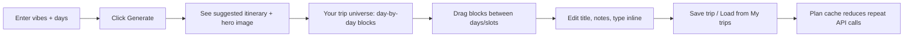
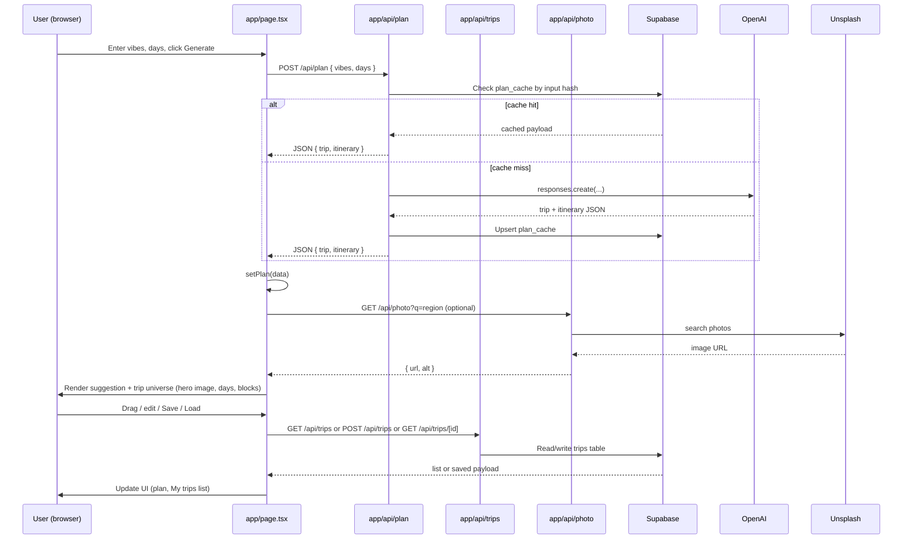
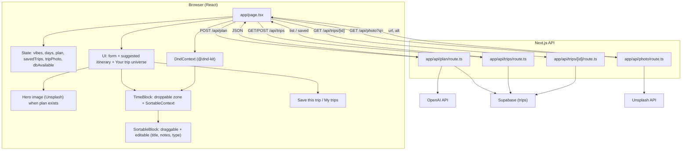
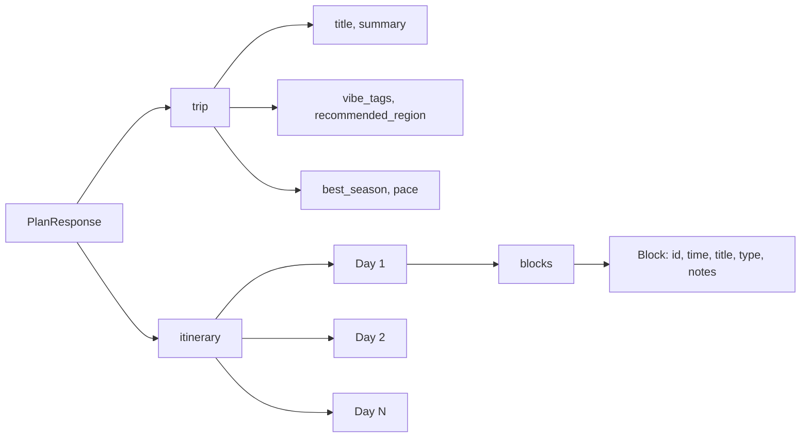

# How the Travel Planner works

This doc helps you explain the site to others: **what it does** and **how it’s built**, with flowcharts you can view in any Mermaid-supported viewer (e.g. GitHub, VS Code, or [mermaid.live](https://mermaid.live)).

---

## 1. User journey (what the user sees)

**In words:** The user types vibes and days, then clicks **Generate itinerary**. They see a **suggested itinerary** (trip title, summary, optional hero photo from Unsplash, region, season, pace). Below that, **Your trip universe** lets them elaborate, tweak, and mold the trip: drag blocks between days and time slots, click title/notes to edit inline, change activity type. They can **Save this trip** (if Supabase is configured) and **My trips** to load a saved itinerary. Identical generate requests use a **plan cache** to avoid extra OpenAI calls.

---

## 2. System flow (request → response)

**In words:** Generate hits `/api/plan`, which checks Supabase `plan_cache` by input hash; on miss it calls OpenAI and caches the result. The client optionally fetches a hero image from `/api/photo` (Unsplash). Save/load uses `/api/trips` (GET list, POST save, GET by id) backed by Supabase `trips` table. Drag and inline edits update client state; Save persists the current plan.

---

## 3. App structure (files and roles)

**In words:** `app/page.tsx` holds all state and renders the form, suggested itinerary (with optional Unsplash hero), and **Your trip universe** (DndContext + day cards + sortable blocks). Drag-and-drop uses **DragOverlay** for a visible drag preview and **defaultScreenReaderInstructions** so keyboard and screen-reader users can reorder and move blocks. Save/Load and My trips call `/api/trips`. Plan generation uses `/api/plan` (with optional Supabase plan cache). Trip images come from `/api/photo` (Unsplash). See `docs/supabase-schema.sql` for DB tables.

---

## 4. Data shape (what’s in a “plan”)

**In words:** A plan has **trip** (metadata) and **itinerary** (days with blocks). Saved trips in Supabase store the full plan as `payload` (same shape). Plan cache stores plans keyed by hash(vibes, days) to reduce OpenAI calls. Drag-and-drop and inline edits update client state; **Save this trip** persists to Supabase.

---

## Using these diagrams

- **GitHub / GitLab:** Paste the Mermaid blocks into a `.md` file; they render automatically.
- **VS Code:** Use a “Mermaid” or “Markdown Preview Mermaid” extension.
- **Online:** Copy a block into [mermaid.live](https://mermaid.live) to edit and export as PNG/SVG.
- **Presentations:** Use the “User journey” and “System flow” to explain the value and the tech in one slide each.
